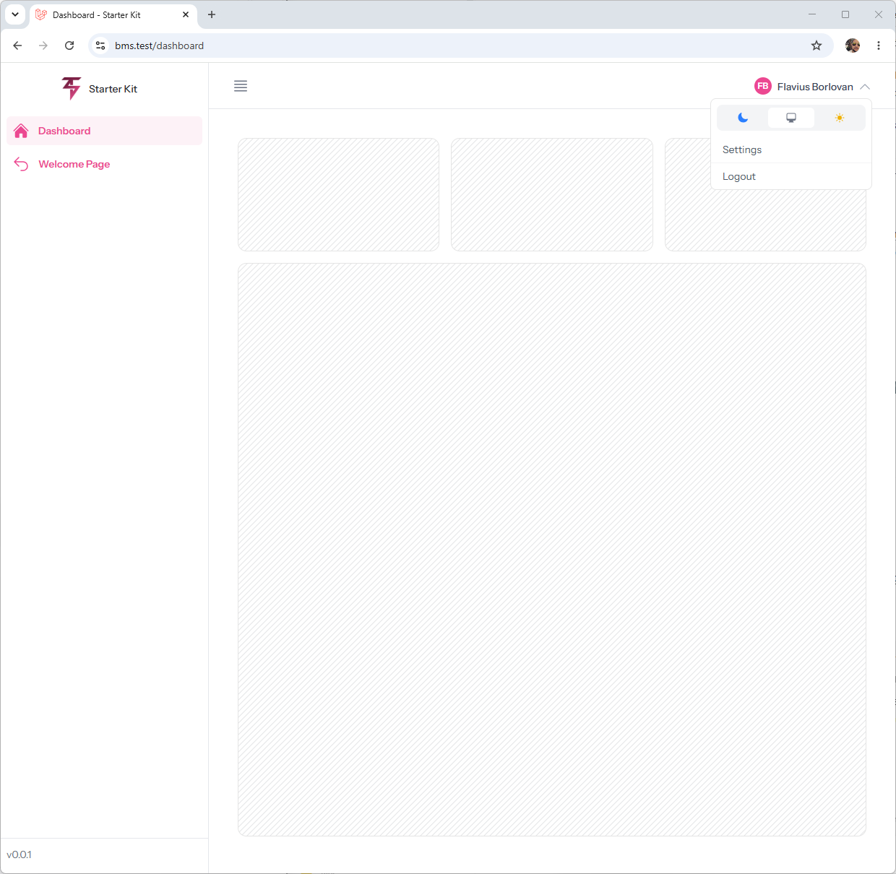
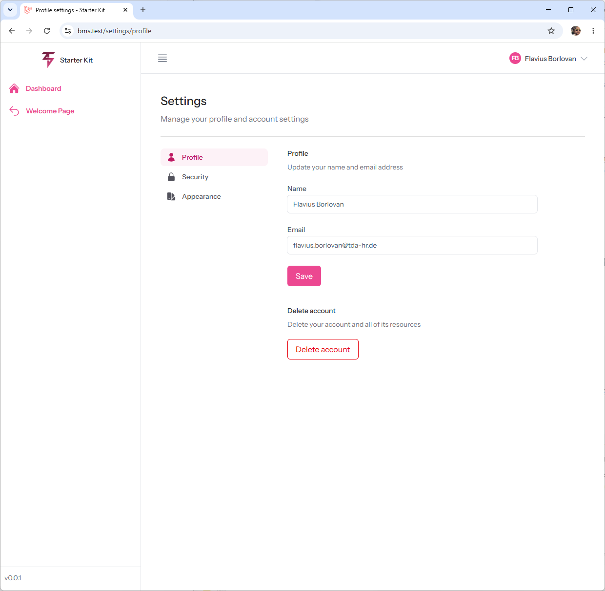
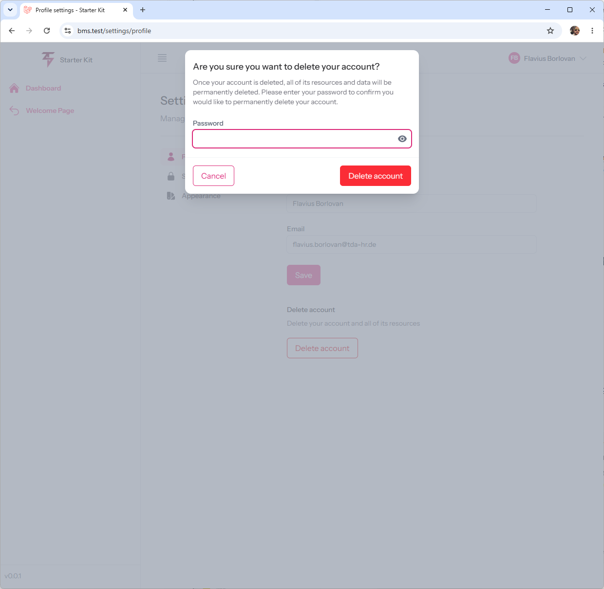
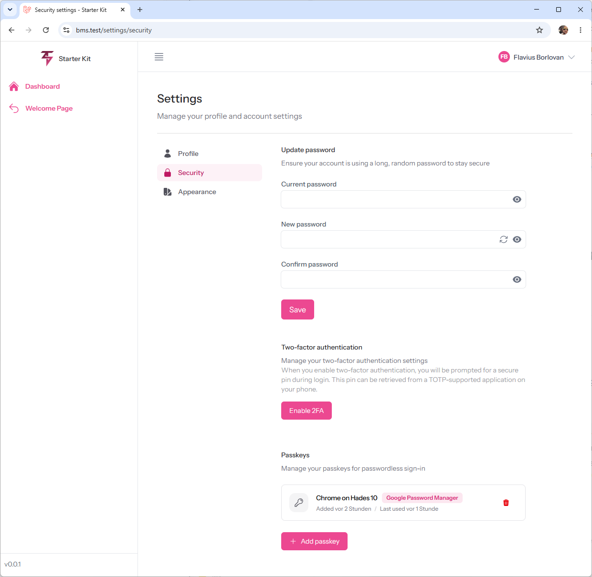
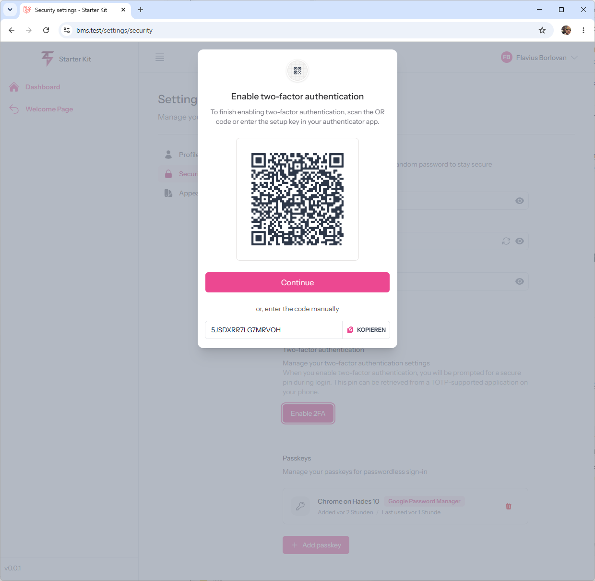
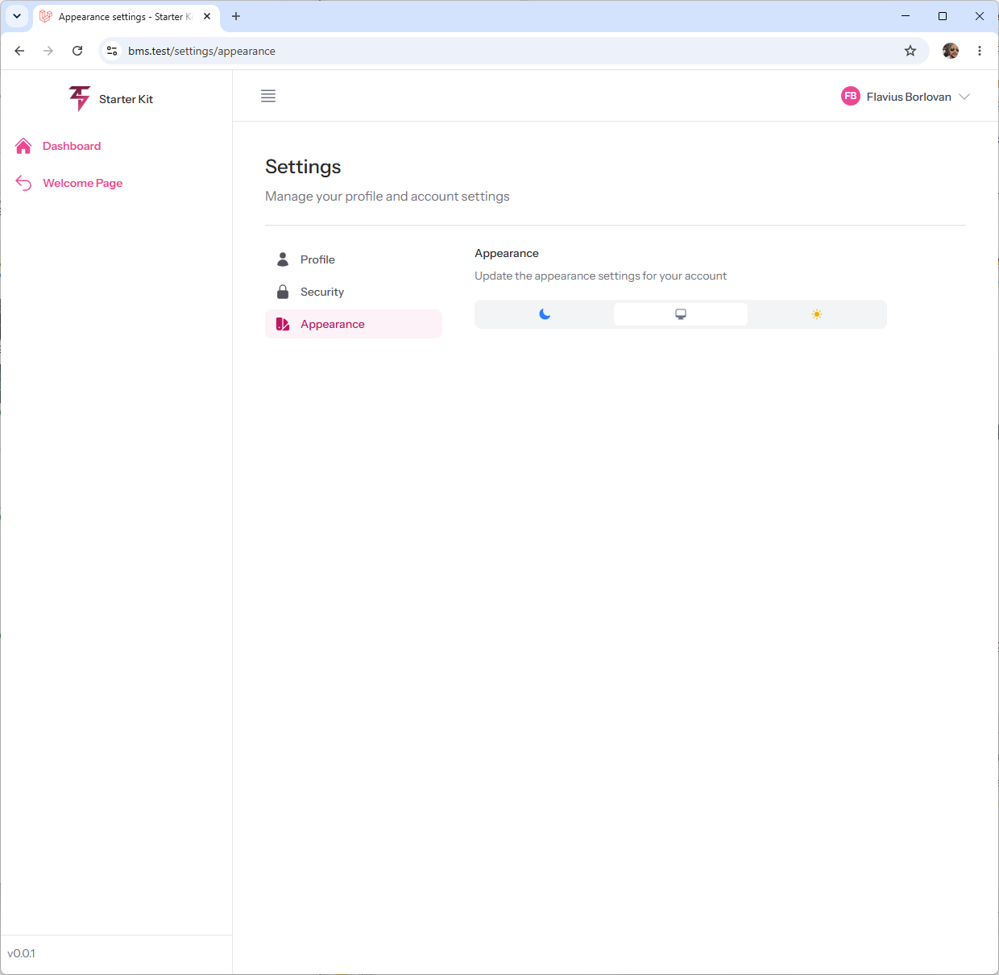

# TallStackUI Starter Kit

A Laravel 13 + Livewire 4 starter kit for authentication, built entirely with **[TallStackUI](https://tallstackui.com)** instead of Flux.

It started as the [official Laravel Livewire starter kit](https://github.com/laravel/livewire-starter-kit) and had every Flux component swapped for a TallStackUI equivalent — including a handful of small components that TallStackUI doesn't ship out of the box, rebuilt from scratch to match the look of their Flux counterparts.

## Screenshots

<table>
<tr>
<td width="50%">

**Dashboard**


</td>
<td width="50%">

**Profile settings**


</td>
</tr>
<tr>
<td width="50%">

**Delete account confirmation**


</td>
<td width="50%">

**Security settings** — password, 2FA, passkeys


</td>
</tr>
<tr>
<td width="50%">

**Two-factor authentication setup**


</td>
<td width="50%">

**Appearance settings** — light / system / dark


</td>
</tr>
</table>

## Features

- **Authentication** (Laravel Fortify): login, registration, password reset, email verification
- **Two-factor authentication** with recovery codes
- **Passkeys** (WebAuthn) as a login and 2FA method
- **Settings pages**: profile, security, appearance (light/dark/system theme)
- Fully built with TallStackUI components — no Flux dependency
- SQLite by default, full Pest test coverage, Pint + PHPStan configured

## Requirements

- PHP 8.3+
- Node 18+
- Composer

## Installation

### Option A: Laravel installer (recommended)

This starter kit is published on [Packagist](https://packagist.org/packages/flavius-constantin/tallstackui-starter), so the [Laravel installer](https://laravel.com/docs/installation#the-laravel-installer)'s `new` command can pull it in directly by package name:

```bash
laravel new my-app --using=flavius-constantin/tallstackui-starter
```

This resolves the package via Composer, runs `composer create-project`, generates your `APP_KEY`, and walks you through the usual database prompts — exactly like installing an official starter kit.

### Option B: git clone

```bash
git clone https://github.com/flavius-constantin/tallstackui-starter.git my-app
cd my-app
composer install
npm install

cp .env.example .env
php artisan key:generate
touch database/database.sqlite

php artisan migrate
npm run build   # or `composer run dev` for a hot-reloading dev server
```

Visit `/register` to create your first account.

## Tech stack

| | |
|---|---|
| Framework | Laravel 13 |
| Reactivity | Livewire 4 |
| UI components | TallStackUI 4 |
| CSS | Tailwind CSS 4 |
| Auth backend | Laravel Fortify |
| Testing | Pest |

## Custom components

TallStackUI covers buttons, inputs, modals, dropdowns, the sidebar, and most of what a CRUD app needs — but the original Flux-based starter kit also leaned on a few small **typography and layout primitives** that TallStackUI doesn't provide (`flux:heading`, `flux:subheading`, `flux:text`, `flux:separator`, `flux:brand`, `flux:navlist.item`). Those live in [`resources/views/components`](resources/views/components) as plain, dependency-free Blade components — rebuilt to look the same, stripped down to only what this starter kit actually uses.

They're intentionally minimal: no Alpine/JS behavior, no Flux Pro features (grouping, badges, tooltips, kbd hints, collapsible nav groups) — just Blade + Tailwind classes via `$attributes->class()`. That keeps them easy to read and easy to extend if you need more.

### `<x-heading>`

Section heading. Renders a semantic `h1`–`h6` when you pass `level`, otherwise a plain `div` styled the same way.

```blade
<x-heading size="2xl" level="1">Settings</x-heading>
```

| Prop | Values | Default |
|---|---|---|
| `size` | `xs`, `sm`, `base`, `lg`, `2xl`, `4xl` | `sm` |
| `level` | `1`–`6` | `null` (renders a `div`) |

Adds a small margin automatically when immediately followed by an `<x-subheading>`.

### `<x-subheading>`

Muted caption that pairs with `<x-heading>`.

```blade
<x-heading level="1">Settings</x-heading>
<x-subheading>Manage your profile and account settings</x-subheading>
```

| Prop | Values | Default |
|---|---|---|
| `size` | `xs`, `sm`, `base`, `lg` | `sm` |

### `<x-text>`

General-purpose body text, with the same color/weight vocabulary as Flux's `flux:text`.

```blade
<x-text variant="strong">Recovery codes</x-text>
<x-text inline color="red">This action cannot be undone.</x-text>
```

| Prop | Values | Default |
|---|---|---|
| `inline` | `bool` — renders `span` instead of `p` | `false` |
| `variant` | `strong`, `subtle` | `null` (default gray) |
| `color` | any Tailwind color name (`red`, `blue`, `emerald`, …) | `null` |
| `size` | `xs`, `sm`, `base`, `lg`, `xl`, `2xl` | `sm` |

### `<x-separator>`

Horizontal or vertical divider, optionally with a centered label.

```blade
<x-separator />
<x-separator vertical class="mx-4" />
<x-separator text="or" />
```

| Prop | Values | Default |
|---|---|---|
| `vertical` | `bool` | `false` |
| `variant` | `subtle` | `null` |
| `text` | string label rendered between two lines | `null` |

### `<x-brand>`

Logo + app name, used as a link (e.g. in the sidebar header). Renders whatever you put in the slot next to the name.

```blade
<x-brand :name="config('app.name')" href="/" wire:navigate>
    <x-app-logo-icon class="size-8!" />
</x-brand>
```

| Prop | Default |
|---|---|
| `name` | `null` |
| `href` | `/` |

This is exactly how [`x-app-logo`](resources/views/components/app-logo.blade.php) is built.

### `<x-navlist-item>`

A single navigation link with an optional icon and an active ("current") state — used for the settings sidebar (Profile / Security / Appearance).

```blade
<x-navlist-item icon="user" :href="route('profile.edit')" :current="request()->routeIs('profile.*')" wire:navigate>
    {{ __('Profile') }}
</x-navlist-item>
```

| Prop | Values | Default |
|---|---|---|
| `href` | *(required)* | — |
| `icon` | any [TallStackUI icon](https://tallstackui.com/docs/components/icon) name | `null` |
| `current` | `bool` — applies active styling + `aria-current="page"` | `false` |

Unlike Flux's `flux:navlist.item`, there's no parent `flux:navlist.group` — it's a flat list, which is all the settings nav needs. The main app sidebar itself doesn't use this component at all; it uses TallStackUI's own `<x-side-bar.item>` (see [`sidebar.blade.php`](resources/views/components/sidebar.blade.php)).

### `<x-app-logo-icon>`

Renders the app's logo image, with an optional separate image for dark mode.

```blade
<x-app-logo-icon class="size-8!" />
<x-app-logo-icon logo="/images/logo.svg" logo-dark="/images/logo-dark.svg" />
```

| Prop | Default |
|---|---|
| `logo` | `asset('images/tsui.png')` (placeholder — replace with your own) |
| `logoDark` | `null` |
| `alt` | `config('app.name', 'Laravel')` |

The original starter kit's version was an inline Laravel SVG mark. This one instead renders an ``, so you can just drop your own logo file into `public/images` and update the default — no SVG editing required.

## What changed vs. the original starter kit

| Area | Before (Flux) | After (TallStackUI) |
|---|---|---|
| Auth pages, settings pages, layouts | `flux:*` components | TallStackUI components (`x-input`, `x-password`, `x-button`, `x-dropdown`, …) |
| Sidebar / header | `flux:sidebar`, `flux:header`, `flux:navlist` | TallStackUI `<x-side-bar>` / `<x-side-bar.item>` (see [`layouts/app.blade.php`](resources/views/layouts/app.blade.php)) |
| Typography & layout primitives | Flux built-ins (`flux:heading`, `flux:subheading`, `flux:text`, `flux:separator`, `flux:brand`) | Rebuilt locally, see [Custom components](#custom-components) above |
| User menu | `desktop-user-menu.blade.php` (Flux dropdown) | [`user-menu.blade.php`](resources/views/components/user-menu.blade.php) (TallStackUI `<x-dropdown>`) |
| `resources/css/app.css` | Imports `flux.css`, Flux-specific focus-ring rules | Imports TallStackUI's `v4.css`, adds `@tailwindcss/forms`, custom `--color-primary-*` theme scale |

Everything else — Fortify actions, routes, migrations, tests — is untouched application scaffolding.

## Testing

```bash
php artisan test
```

## Credits

- [Caleb Porzio](https://github.com/calebporzio) and the [Flux](https://fluxui.dev) team — the original starter kit's UI, and the inspiration for the custom components rebuilt here
- [AJ Meireles](https://github.com/devajmeireles) — creator of [TallStackUI](https://tallstackui.com)

## License

MIT, same as the [official Laravel Livewire starter kit](https://github.com/laravel/livewire-starter-kit) it's based on.
